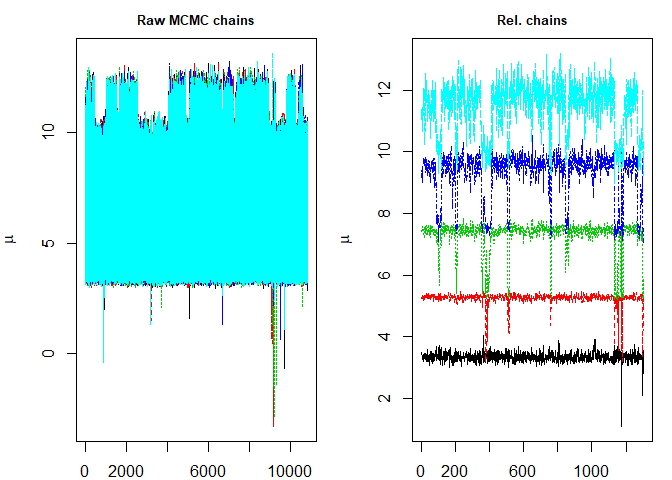
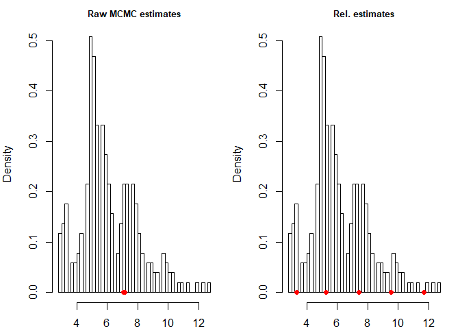
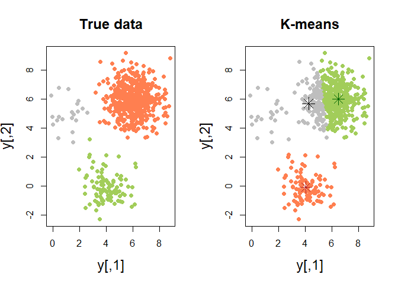
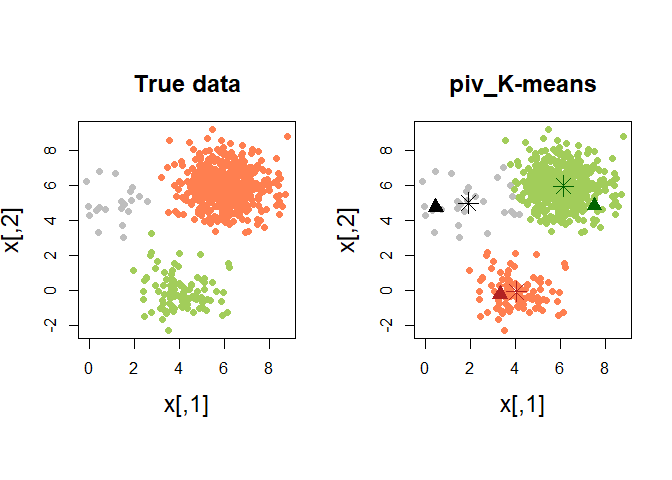

<!-- README.md is generated from README.Rmd. Please edit that file -->
pivmet
======

The goal of `pivmet` is to propose some pivotal methods in order to:

-   undo the label switching problem which naturally arises during the MCMC sampling in Bayesian mixture models →**pivotal relabelling** (Egidi et al. 2018a)

-   initialize the K-means algorithm → **pivotal seeding** (Egidi et al. 2018b)

Installation
------------

-PAY ATTENTION! BEFORE INSTALLING: make sure to download the JAGS program at <https://sourceforge.net/projects/mcmc-jags/>.

You can then install pivmet from github with:

``` r
# install.packages("devtools")
devtools::install_github("leoegidi/pivmet")
```

Example 1. Dealing with label switching: relabelling in Bayesian mixture models by pivotal units (fish data)
------------------------------------------------------------------------------------------------------------

First of all, we load the package and we import the `fish` dataset belonging to the `bayesmix` package:

``` r
library(pivmet)
#> Loading required package: mvtnorm
#> Loading required package: bayesmix
#> Loading required package: RcmdrMisc
#> Loading required package: car
#> Loading required package: carData
#> Loading required package: sandwich
#> Loading required package: cluster
#> Loading required package: mclust
#> Package 'mclust' version 5.4.1
#> Type 'citation("mclust")' for citing this R package in publications.
#> Loading required package: runjags
#> Loading required package: rjags
#> Loading required package: coda
#> Linked to JAGS 4.3.0
#> Loaded modules: basemod,bugs
#> Loading required package: MASS
data(fish)
y <- fish[,1]
N <- length(y)
k <- 5
nMC <- 12000
```

Then we fit a Bayesian Gaussian mixture using the `piv_MCMC` function:

``` r
res <- piv_MCMC(y = y, k = k, nMC = nMC)
#> Compiling model graph
#>    Declaring variables
#>    Resolving undeclared variables
#>    Allocating nodes
#> Graph information:
#>    Observed stochastic nodes: 256
#>    Unobserved stochastic nodes: 268
#>    Total graph size: 1050
#> 
#> Initializing model
```

Finally, we can apply pivotal relabelling and inspect the new estimates with the functions `piv_rel` and `piv_plot`, respectively:

``` r
rel <- piv_rel(mcmc=res, nMC = nMC)
piv_plot(y, res, rel, "chains")
```



``` r
piv_plot(y, res, rel, "hist")
```



Example 2. K-means clustering using MUS and other pivotal algorithms
--------------------------------------------------------------------

Sometimes K-means algorithm does not provide an optimal clustering solution. Suppose to generate some clustered data and to detect one pivotal unit for each group with the `MUS` function:

``` r
#generate some data

set.seed(123)
n  <- 620
centers  <- 3
n1 <- 20
n2 <- 100
n3 <- 500
x  <- matrix(NA, n,2)
truegroup <- c( rep(1,n1), rep(2, n2), rep(3, n3))

for (i in 1:n1){
 x[i,]=rmvnorm(1, c(1,5), sigma=diag(2))}
for (i in 1:n2){
 x[n1+i,]=rmvnorm(1, c(4,0), sigma=diag(2))}
for (i in 1:n3){
 x[n1+n2+i,]=rmvnorm(1, c(6,6), sigma=diag(2))}

H <- 1000
a <- matrix(NA, H, n)

  for (h in 1:H){
    a[h,] <- kmeans(x,centers)$cluster
  }

#build the similarity matrix
sim_matr <- matrix(1, n,n)
 for (i in 1:(n-1)){
    for (j in (i+1):n){
      sim_matr[i,j] <- sum(a[,i]==a[,j])/H
      sim_matr[j,i] <- sim_matr[i,j]
    }
  }

cl <- KMeans(x, centers)$cluster
mus_alg <- MUS(C = sim_matr, clusters = cl, prec_par = 5)
```

Quite often, classical K-means fails in recognizing the *true* groups:



In such situations, we may need a more robust version of the classical K-means. The pivots may be used as initial seeds for a classical K-means algorithm. The function `piv_KMeans` works as the classical `kmeans` function, with some optional arguments

``` r
piv_res <- piv_KMeans(x, centers)
```


