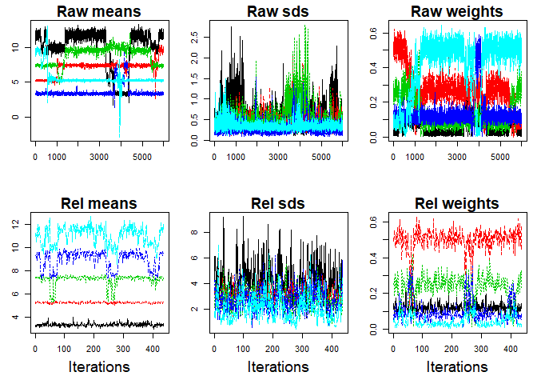

<!-- README.md is generated from README.Rmd. Please edit that file -->

# pivmet

The goal of `pivmet` is to propose some pivotal methods in order to:

  - undo the label switching problem which naturally arises during the
    MCMC sampling in Bayesian mixture models \(\rightarrow\) **pivotal
    relabelling** (Egidi et al. 2018a)

  - initialize the K-means algorithm aimed at obtaining a good
    clustering solution \(\rightarrow\) **pivotal seeding** (Egidi et
    al. 2018b)

## Installation

  - <span style="color:red">PAY ATTENTION\! BEFORE INSTALLING</span>:
    make sure to download the JAGS program at
    <https://sourceforge.net/projects/mcmc-jags/>.

You can then install `pivmet` from github with:

``` r
# install.packages("devtools")
devtools::install_github("leoegidi/pivmet")
```

## Example 1. Dealing with label switching: relabelling in Bayesian mixture models by pivotal units (fish data)

First of all, we load the package and we import the `fish` dataset
belonging to the `bayesmix` package:

``` r
library(pivmet)
#> Loading required package: bayesmix
#> Loading required package: rjags
#> Loading required package: coda
#> Linked to JAGS 4.3.0
#> Loaded modules: basemod,bugs
#> Loading required package: mvtnorm
#> Loading required package: RcmdrMisc
#> Loading required package: car
#> Loading required package: carData
#> Loading required package: sandwich
#> Warning: replacing previous import 'rstan::plot' by 'graphics::plot' when
#> loading 'pivmet'
data(fish)
y <- fish[,1]
N <- length(y)  # sample size 
k <- 5          # fixed number of clusters
nMC <- 12000    # MCMC iterations
```

Then we fit a Bayesian Gaussian mixture using the `piv_MCMC` function:

``` r
res <- piv_MCMC(y = y, k = k, nMC = nMC)
#> Compiling model graph
#>    Declaring variables
#>    Resolving undeclared variables
#>    Allocating nodes
#> Graph information:
#>    Observed stochastic nodes: 256
#>    Unobserved stochastic nodes: 268
#>    Total graph size: 1050
#> 
#> Initializing model
```

Finally, we can apply pivotal relabelling and inspect the new posterior
estimates with the functions `piv_rel` and `piv_plot`, respectively:

``` r
rel <- piv_rel(mcmc=res)
piv_plot(y = y, mcmc = res, rel_est = rel, type = "chains")
```

<!-- -->

    #> Description: traceplots of the raw MCMC chains and the relabelled chains for all the model parameters: means, sds and weights. Each colored chain corresponds to one of the k distinct parameters of the mixture model. Overlapping chains may reveal that the MCMC sampler is not able to distinguish between the components.
    piv_plot(y = y, mcmc = res, rel_est = rel, type = "hist")

<!-- -->

    #> Description: histograms of the data along with the estimated posterior means (red points) from raw MCMC and relabelling algorithm. The blue line is the estimated density curve.

## Example 2. K-means clustering using MUS and other pivotal algorithms

Sometimes K-means algorithm does not provide an optimal clustering
solution. Suppose to generate some clustered data and to detect one
pivotal unit for each group with the `MUS` (Maxima Units Search
algorithm) function:

``` r
#generate some data

set.seed(123)
n  <- 620
centers  <- 3
n1 <- 20
n2 <- 100
n3 <- 500
x  <- matrix(NA, n,2)
truegroup <- c( rep(1,n1), rep(2, n2), rep(3, n3))

for (i in 1:n1){
 x[i,]=rmvnorm(1, c(1,5), sigma=diag(2))}
for (i in 1:n2){
 x[n1+i,]=rmvnorm(1, c(4,0), sigma=diag(2))}
for (i in 1:n3){
 x[n1+n2+i,]=rmvnorm(1, c(6,6), sigma=diag(2))}

H <- 1000
a <- matrix(NA, H, n)

  for (h in 1:H){
    a[h,] <- kmeans(x,centers)$cluster
  }

#build the similarity matrix
sim_matr <- matrix(1, n,n)
 for (i in 1:(n-1)){
    for (j in (i+1):n){
      sim_matr[i,j] <- sum(a[,i]==a[,j])/H
      sim_matr[j,i] <- sim_matr[i,j]
    }
  }

cl <- KMeans(x, centers)$cluster
mus_alg <- MUS(C = sim_matr, clusters = cl, prec_par = 5)
```

Quite often, classical K-means fails in recognizing the *true* groups:

``` r
# launch classical KMeans
kmeans_res <- KMeans(x, centers)
# plots
par(mfrow=c(1,2))
colors_cluster <- c("grey", "darkolivegreen3", "coral")
colors_centers <- c("black", "darkgreen", "firebrick")
 
graphics::plot(x, col = colors_cluster[truegroup]
                 ,bg= colors_cluster[truegroup], pch=21,
                  xlab="y[,1]",
                  ylab="y[,2]", cex.lab=1.5,
                  main="True data", cex.main=1.5)
 
graphics::plot(x, col = colors_cluster[kmeans_res$cluster], 
      bg=colors_cluster[kmeans_res$cluster], pch=21, xlab="y[,1]",
      ylab="y[,2]", cex.lab=1.5,main="K-means",  cex.main=1.5)
points(kmeans_res$centers, col = colors_centers[1:centers], 
      pch = 8, cex = 2)
```

<!-- -->

In such situations, we may need a more robust version of the classical
K-means. The pivots may be used as initial seeds for a classical K-means
algorithm. The function `piv_KMeans` works as the classical `kmeans`
function, with some optional arguments (in the figure below, the colored
triangles represent the pivots).

``` r
# launch piv_KMeans
piv_res <- piv_KMeans(x, centers)
# plots
par(mfrow=c(1,2), pty="s")
colors_cluster <- c("grey", "darkolivegreen3", "coral")
colors_centers <- c("black", "darkgreen", "firebrick")
graphics::plot(x, col = colors_cluster[truegroup],
   bg= colors_cluster[truegroup], pch=21, xlab="x[,1]",
   ylab="x[,2]", cex.lab=1.5,
   main="True data", cex.main=1.5)

graphics::plot(x, col = colors_cluster[piv_res$cluster],
   bg=colors_cluster[piv_res$cluster], pch=21, xlab="x[,1]",
   ylab="x[,2]", cex.lab=1.5,
   main="piv_Kmeans", cex.main=1.5)
points(x[piv_res$pivots[1],1], x[piv_res$pivots[1],2],
   pch=24, col=colors_centers[1],bg=colors_centers[1],
   cex=1.5)
points(x[piv_res$pivots[2],1], x[piv_res$pivots[2],2],
   pch=24,  col=colors_centers[2], bg=colors_centers[2],
   cex=1.5)
points(x[piv_res$pivots[3],1], x[piv_res$pivots[3],2],
   pch=24, col=colors_centers[3], bg=colors_centers[3],
   cex=1.5)
points(piv_res$centers, col = colors_centers[1:centers],
   pch = 8, cex = 2)
```

<!-- -->

## References

Egidi, L., Pappadà, R., Pauli, F. and Torelli, N. (2018a). Relabelling
in Bayesian Mixture Models by Pivotal Units. Statistics and Computing,
28(4), 957-969.

Egidi, L., Pappadà, R., Pauli, F., Torelli, N. (2018b). K-means seeding
via MUS algorithm. Conference Paper, Book of Short Papers, SIS2018,
ISBN: 9788891910233.
