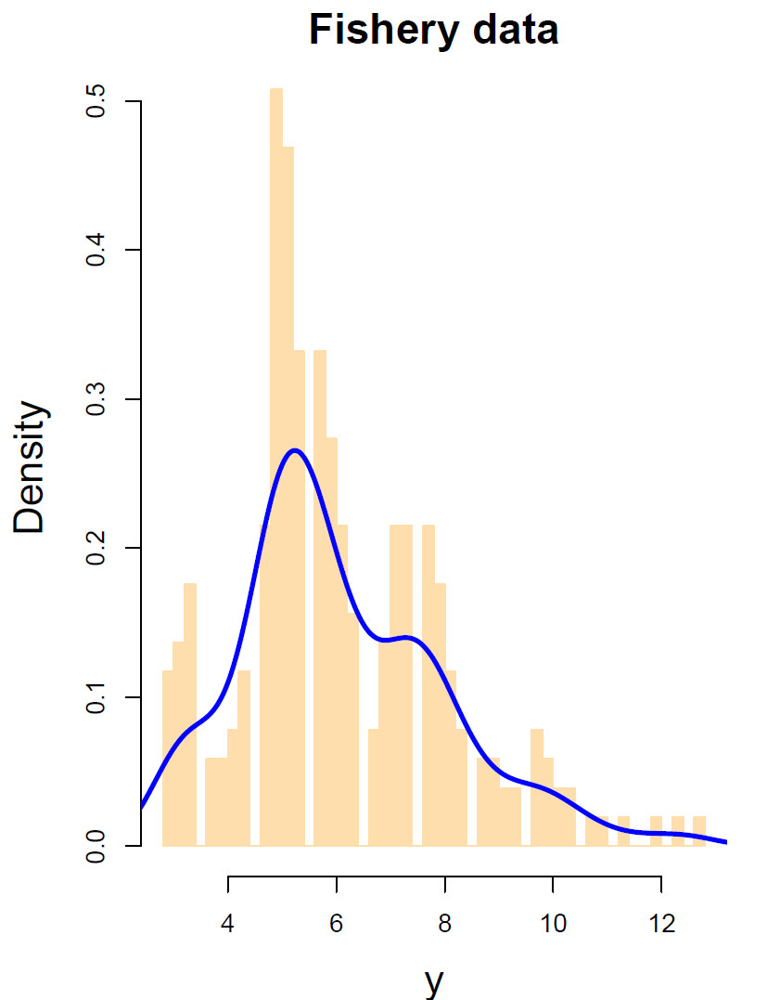

  
# Summary
  
We introduce the `R` package `pivmet`, a software that performs different pivotal methods for identifying, extracting, and using 
the so-called pivotal units  that are chosen from a partition of data points to represent the groups to which they belong. 
Such units turn out be very useful in both unsupervised and supervised learning frameworks such as clustering, 
classification and mixture modelling.  
More specifically, applications of pivotal methods include, among the others: a Markov-Chain Monte Carlo (MCMC) 
relabelling procedure to deal with the well-known label-switching problem occurring during Bayesian estimation of mixture models [@stephens2000dealing; @richardson1997bayesian; 
@fruhwirth2001markov; @egidi2018relabelling]; 
model-based clustering through sparse finite mixture models (SFMM) [@malsiner2016model; @fruhwirth2019here]; consensus clustering [@JMLR02],
which may allow to improve classical clustering techniques---e.g. the classical $k$-means---via a careful seeding; 
and Dirichlet process mixture models (DPMM) in Bayesian nonparametrics [@ferguson1973bayesian; @escobar1995bayesian; @neal2000markov]. 

## Installation

The stable version of the package can be installed from the [Comprehensive R Archive Network (CRAN)](http://CRAN.R-project.org/package=pivmet):
  
```
install.packages("pivmet")
library(pivmet)
```

However, before installing the package, the user should  make sure to download the JAGS program at
[https://sourceforge.net/projects/mcmc-jags/](https://sourceforge.net/projects/mcmc-jags/).

# Statement of need

In the modern *big-data* and *machine learning* age, summarizing some essential information from a dataset is often relevant and can
help simplifying the data pre-processing steps. The advantage of identifying representative units of a group---hereafter *pivotal units* 
or *pivots*---chosen in such a way that they are as far as possible from units in the other groups and/or as similar as possible to the units in the same 
group, is that they may convey relevant information about the group they belong to while saving wasteful operations.  
Despite the lack of a strict theoretical framework behind their characterization, the pivots may be beneficial in many machine learning frameworks,
such as clustering, classification, and mixture modelling when the interest is in deriving reliable estimates in mixture models and/or finding a partition of the data points.  The theoretical framework concerning the pivotal methods implemented in the `pivmet` package is provided in [@egidi2018relabelling].

The `pivmet`  package  for `R` is available from the Comprehensive `R`  Archive Network (CRAN) at
[http://CRAN.R-project.org/package=pivmet](http://CRAN.R-project.org/package=pivmet) [@pivmet] and implements various pivotal selection criteria to 
deal with, but not limited to: (i) mixture model Bayesian estimation---either via the JAGS software [@rjags] using Gibbs sampling or 
the Stan [@rstan] software performing Hamiltonian Monte Carlo (HMC)---to tackle the so-called *label switching* problem; 
(ii) consensus clustering, where  a variant of the $k$-means algorithm is available; (iii) Dirichlet Process Mixture Models (DPPM). 


As far as we know from reviewing the scientific and statistical literature, the `pivmet` package is the only software designed to search pivotal units in a modern machine learning framework. However, since its large applicability, 
it exhibits some deep connections with some existing `R` packages commonly used for Bayesian statistics and clustering. In particular, the `pivmet` package:

-  extends the `bayesmix` package [@bayesmix], which allows to 
fit univariate Gaussian mixtures, by allowing for sparse Gaussian univariate/multivariate mixtures;

-  is naturally connected with the `label.switching` package [@papastamoulis2016label] that offers many methods to fix label switching in Bayesian mixture models;

- in terms of computational MCMC methods, depends on the `rstan` package [@rstan] to perform Hamiltonian Monte Carlo sampling and on the `rjags` package [@rjags] to perform Gibbs sampling;

-  extends the classical `kmeans` function by allowing for a robust initial seeding.


Compared to the aforementioned packages, the `pivmet` package offers a novel way to retrieve pivotal units. Moreover, it contains functions to exploit the pivotal units to efficiently estimate univariate and multivariate Gaussian mixtures, by relying on pre-compiled JAGS/Stan models, and to perform a robustified version of the $k$-means algorithm. 
 


# Overview and main functions

The package architecture strongly relies on three main functions:

- The function `piv_MCMC()` is used to fit a Bayesian Gaussian mixture model with underlying Gibbs sampling  or Hamiltonian Monte Carlo algorithm. 
The user can specify distinct prior distributions with the argument `priors` and the selected pivotal criterion via the argument `piv.criterion`.

- The function `piv_rel()` takes in input the model fit returned by `piv_MCMC` and implements the relabelling step as outlined by [@egidi2018relabelling].

- The function `piv_KMeans()` performs a robust consensus clustering based on distinct $k$-means partitions. The user can specify some options, 
such as the number of consensus partitions.


# Example 1: relabelling for dealing with label switching 

The Fishery dataset in the `bayesmix` [@bayesmix] package has been previously used by @titterington1985statistical and @papastamoulis2016label. 
It consists of 256 snapper length measurements---see left plot of \autoref{fig:example1} for the data histogram, along with an estimated 
kernel density. Analogously to some previous works, we assume a Gaussian mixture model  with $k=5$ groups, where $\mu_j$, $\sigma_j$ and $\eta_j$ 
are respectively the mean, the standard deviation and the weight of group $j = 1, \dots, k$. We fit our model by simulating $15000$ samples from the 
posterior distribution of $(\mathbf{z}, \boldsymbol{\mu}, \boldsymbol{\sigma}, \boldsymbol{\eta})$, by selecting the default argument `software="rjags"`; 
for univariate mixtures, the MCMC Gibbs sampling is returned by the function `JAGSrun` in the package `bayesmix`. Alternatively, one could fit 
the model according to HMC sampling and with underlying Stan ecosystem by typing `software="rstan"`. By default, the burn-in period is set equal to 
half of the total number of MCMC iterations.  Here below we include the relevant `R` code.

```
# required packages
library(bayesmix)
set.seed(100)

# load data
data(fish)
y <- fish[,1]
k <- 5
nMC <- 15000

# fit the mixture model for univariate data and find the pivots
res <- piv_MCMC(y = y, k = k, nMC = nMC, burn = 0.5*nMC, software = "rjags")

# relabel the chains: figure 
rel <- piv_rel(mcmc=res)
piv_plot(y = y, mcmc = res, rel_est = rel, type="chains")

# use Stan
res_stan <- piv_MCMC(y = y, k = k, nMC = nMC/3, burn = 0.5*nMC/3, software ="rstan")
cat(res_stan$model)
```




{width=60%}


\autoref{fig:example2} displays the traceplots for the parameters $(\mathbf{\mu}, \mathbf{\sigma}, \mathbf{\eta})$. From the first row 
showing the raw MCMC outputs as given by the Gibbs sampling, we note that label switching clearly occurred. Our algorithm is able to fix label-switching 
and reorder the means $\mu_j$ and the weights $\eta_j$, for $j=1,\ldots,k$, as emerged from the second row of the plot. 


# Example 2: consensus clustering

As widely known, one of the drawbacks of the $k$-means algorithm is represented by its inefficiency in distinguishing between groups of unbalanced sizes. 
The recent literature on clustering methods has explored some approaches to combine several partitions via a consensus clustering, which may improve the solution obtained from a single run of a clustering algorithm.  
Here, we consider a consensus clustering technique based on $k$-means and pivotal methods used for a careful initial pivotal seeding.

For illustration purposes, we simulate three bivariate Gaussian distributions with 20, 100 and 500 observations, respectively---see \autoref{fig:example3}.
The plots with titles 'piv KMeans' refer to the pivotal criteria `MUS` (`piv_KMeans[1]`),  `maxsumint` (`piv_KMeans[2]`), and `maxsumdiff` (`piv_KMeans[4]`); moreover, we consider Partitioning Around Medoids (PAM) method via the `pam` function of the `cluster` package and agglomerative hierarchical
clustering (agnes), with average, single, and complete linkage.  Group centers and pivots are marked via asterisks and triangles symbols, respectively. As can be seen, pivotal $k$-means methods are able to  satisfactorily detect
the true data partition and outperform the alternative approaches in most of the cases. Here below we include the relevant `R` code.


```
# required packages
library(mvtnorm)

# simulate data
set.seed(123)
n=620
k=3
n1=20
n2=100
n3=500
x=matrix(NA, n,2)
gruppovero=c( rep(1,n1), rep(2, n2), rep(3, n3))

for (i in 1:n1){
  x[i,]=rmvnorm(1, c(1,5), sigma=diag(2))
}
for (i in 1:n2){
  x[n1+i,]=rmvnorm(1, c(4,0), sigma=diag(2))
}
for (i in 1:n3){
  x[n1+n2+i,]=rmvnorm(1, c(6,6), sigma=diag(2))
}

kmeans_res <- kmeans(x, centers=k)

# consensus clustering step
res1 <- piv_KMeans(x, k, alg.type = "hclust",
                   piv.criterion ="maxsumdiff",
                   prec_par=n1)
```

{width=60%}


# Conclusion

The `pivmet` package proposes various methods for identifying pivotal units in datasets with a grouping structure and uses them for improving 
inferential conclusions and clustering partitions. The package suits well for both supervised and unsupervised problems, by providing a valid alternative
 to existing functions for similar applications, and keeping low the computational effort. It is of future interest to include additional functions that may allow to deal with the estimation of the number of components 
in the data when this information is latent or unknown and provide more graphical tools to diagnose pivotal selection. 


# Reproducibility

The `R` code required to generate the examples is available at
 [https://github.com/LeoEgidi/pivmet/tree/master/paper/rcode](https://github.com/LeoEgidi/pivmet/tree/master/paper/rcode).


# Acknowledgements

The authors thank Ioannis Ntzoufras and Dimitris Karlis from Athens University of Economics and Business (AUEB) for their valuable suggestions about the package structure.


# References
